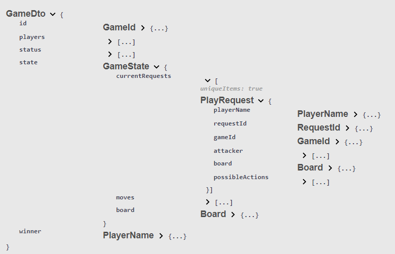

# Zühlke Coding Challenge 2023

## Setup

If your setup already has some of the required tools installed, please adjust accordingly.

1. Install a new version of IntelliJ
2. Clone the master branch with `git clone https://bitbucket.zuehlke.com/scm/ztopcha/zuehlke-challenge-2023.git`
3. Open the project with IntelliJ and let gradle build the project
4. If prompted, install java (17.0.5)

### Recommended IntelliJ plugins:

- Lombok (usually already installed)
- Spring (usually already installed)
- Prettier

## How to run

1. Edit the name of your bot and add your access token in the properties file
   `bot/src/main/resources/application.properties`
2. Read the rules and familiarize yourself with the game
   https://zuehlke-coding-challenge.herokuapp.com/rules
3. Adjust your bots logic by editing the RandomBot class
   Alternatively, you may implement the bot interface in your own class
4. Start your bot by running the RandomBot run configuration

## For implementation with different technologies

To see the relevant endpoints, take a look at swagger:
Swagger: https://zuehlke-coding-challenge.herokuapp.com/swagger-ui/index.html

### Basic structure

1. First your bot should join the lobby by sending a `JoinRequest` to `https://zuehlke-coding-challenge.herokuapp.com/api/lobby/join`
   The admin will then create a tournament which will determine the games your bot will be assigned to.
   When these games are created the server will publish updates on the game topic.
2. Your bot should then subscribe to the websocket `/topic/game/`, there the server will send the `GameDto` object:

3. Your bot should then check if the game is running by looking at the `status` enum
4. Next it needs to check the `state` which contains a list of `PlayRequest` in `currentRequests`
5. If the PlayRequest contains your `playerName` your bot should send his `Move` to `https://zuehlke-coding-challenge.herokuapp.com/api/game/{gameId}/play`
   To decide which move to make you can use the information provided in the PlayRequest.
