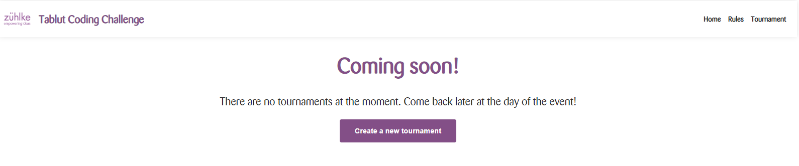
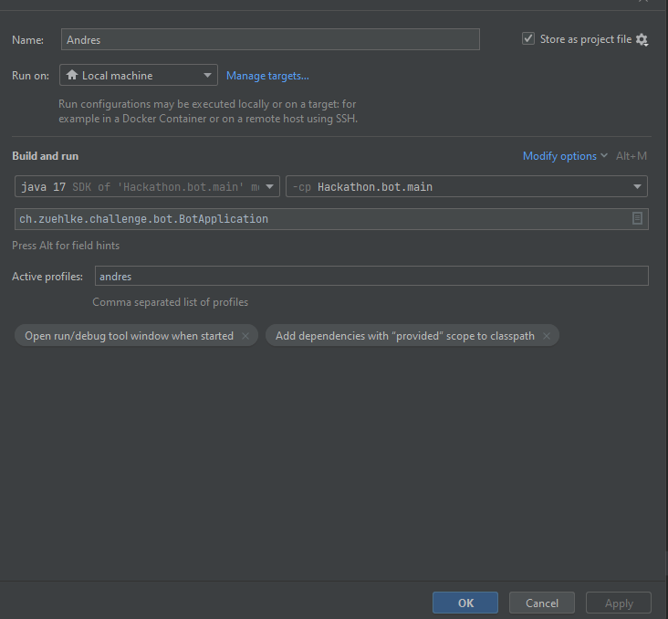
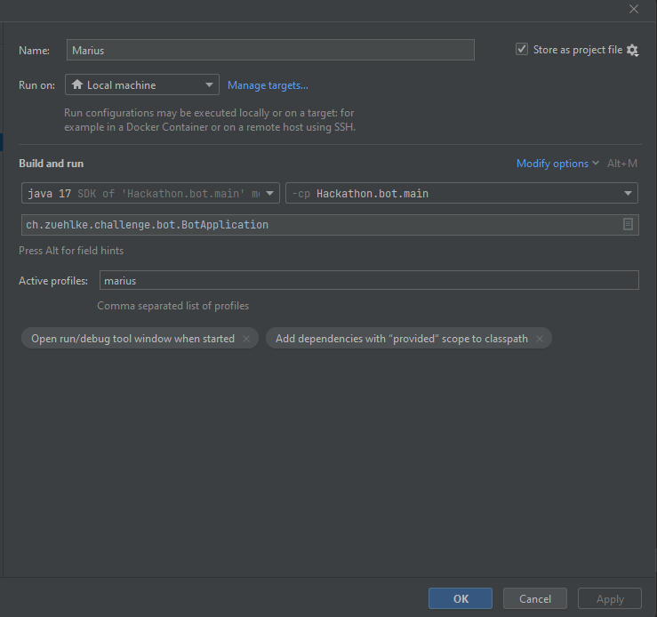
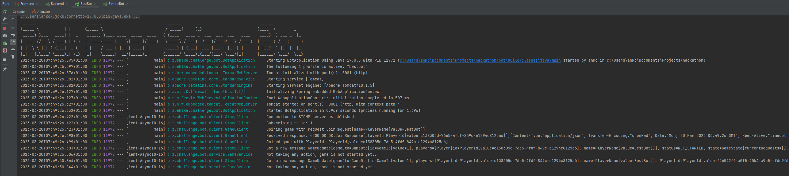
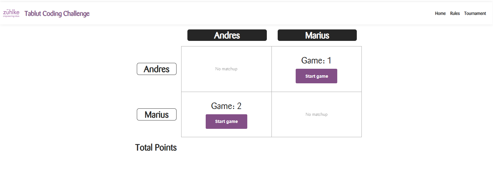
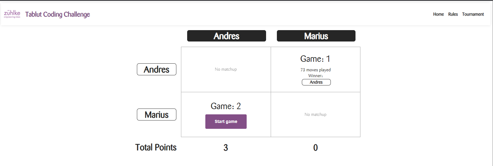

# Java Fullstack Hackathon 2023

## Topic: Zühlke Coding Challenge

---

## Setup

If your setup already has some of the required tools installed, please adjust accordingly.

1. Install a new version of IntelliJ
2. Clone the master branch with `git clone https://bitbucket.zuehlke.com/scm/ztopcha/zuehlke-challenge-2023.git`
3. Open the project with IntelliJ and let gradle build the project
4. If prompted, install java (17.0.5)

### Recommended IntelliJ plugins:

- Lombok (usually already installed)
- Spring (usually already installed)
- Prettier

## Overview / How to run

1. Edit the name of your bot and add the access token in the properties file
   bot/src/main/resources/application.properties
2. Read the rules and familiarize yourself with the game
   https://zuehlke-coding-challenge.herokuapp.com/rules
3. Create your bots logic by implementing the bot interface in your own class
4. Start your bot by running the 

This module contains the logic of how bots should connect to the backend game server and play "Tablut".
By using different Spring Profiles, you can switch between different implementations of the bots "brain".

1. Create a tournament in the frontend by clicking on "Tournaments" and then "Create Tournament".
   
2. Start "Andres" using the run configuration "Andres". It uses port 8081.
   
2. Start "Marius" using the run configuration "SimpleBot". It uses port 8082.
   
3. Both consoles of the bots should now be waiting for the tournament to start and have a console output similar to
   this:
   
3. The tournament you created in the frontend should now be ready to be started.
4. Start the tournament by clicking the button "Start".
5. Click on the "Spectate" button to see the pairings of the bots.
   
6. Click on the "Start game" button and wait for the game to be finished.
5. The game should be finished, as can be seen in the frontend:
   

## Production URLs

Frontend: https://zuehlke-coding-challenge.herokuapp.com/

Swagger: https://zuehlke-coding-challenge.herokuapp.com/swagger-ui/index.html

