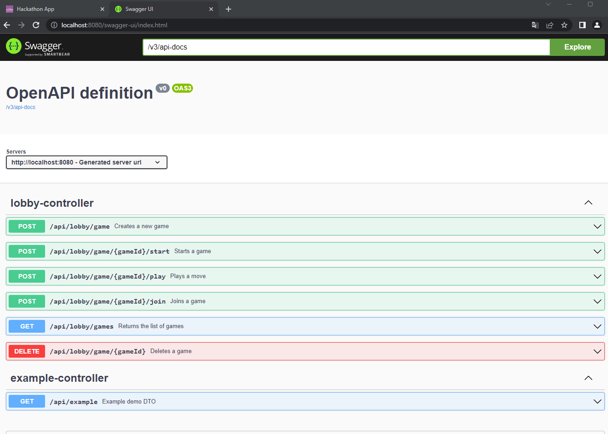
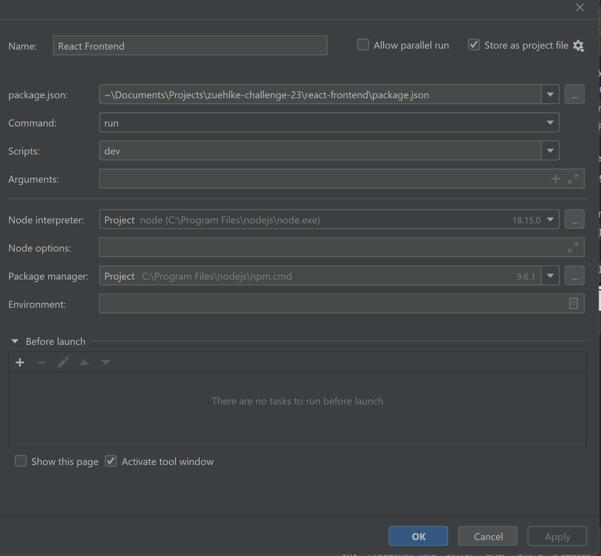
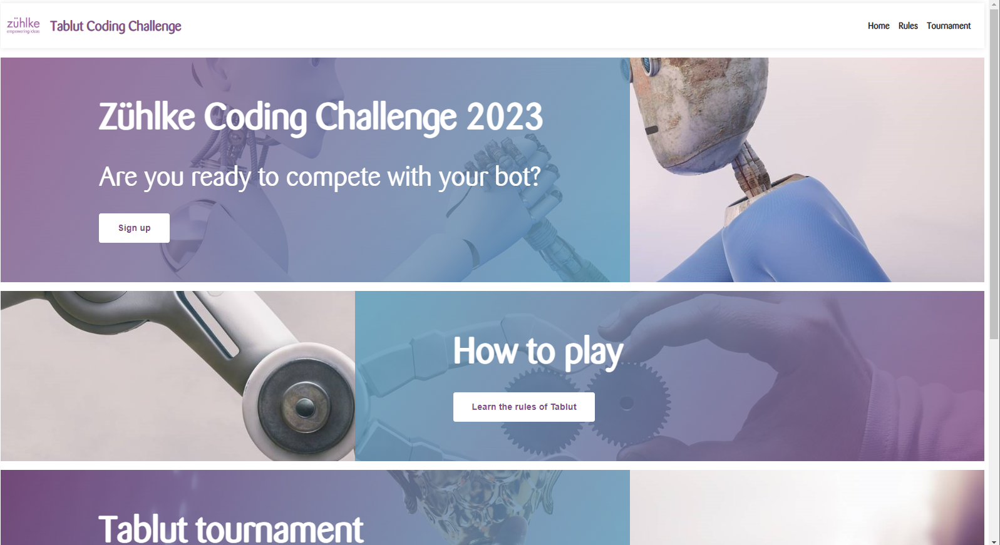

# Java Fullstack Hackathon 2023

## Topic: Zühlke Coding Challenge

---

## Setup

If your setup already has some of the required tools installed, please adjust accordingly.

1. Install newest Node from here https://nodejs.org/en/ (currently 18.15.0 LTS)
2. Run `npm install -g npm@9.6.1`
3. Verify your versions with 
   - `npm -v`: 9.6.1
   - `node -v`: v18.15.0
4. Install a new version of IntelliJ
5. Clone the master branch with `git clone https://github.com/Cyberdog52/hackathon.git`
6. Open the project with IntelliJ and let gradle build the project
7. If prompted, install java (17.0.5)
7. Install the npm dependencies with `cd react-frontend` followed by `npm install`

During the hackathon your team can decide to use a custom branch on this GitHub repository or to fork it to your own
private repository.

## Overview / How to run

### Start backend

1. Start the backend either by
    1. By selecting the "Backend" run configuration and running it
       
    2. Or by executing `./gradlew bootRun`

You should be able to open the Swagger endpoint documentation at `http://localhost:8080/swagger-ui/index.html`.

### Start react frontend

1. Start the react frontend either by
    1. By selecting the "React Frontend" and running it
       
    2. Or by executing `cd react-frontend` followed by `npm run dev` \
2. You should now be able to open `http://localhost:5173` in your favorite browser to access the frontend.

Now you should see the following screen:

### Start bots

This module contains the logic of how bots should connect to the backend game server and play "Tablut".
By using different Spring Profiles, you can switch between different implementations of the bots "brain".

1. Create a tournament in the frontend by clicking on "Tournaments" and then "Create Tournament".
   
2. Start "Andres" using the run configuration "Andres". It uses port 8081.
   
2. Start "Marius" using the run configuration "SimpleBot". It uses port 8082.
   
3. Both consoles of the bots should now be waiting for the tournament to start and have a console output similar to
   this:
   
3. The tournament you created in the frontend should now be ready to be started.
4. Start the tournament by clicking the button "Start".
5. Click on the "Spectate" button to see the pairings of the bots.
   
6. Click on the "Start game" button and wait for the game to be finished.
5. The game should be finished, as can be seen in the frontend:
   

### common module

This module is used to share code between the backend and the bots. It mainly consists of domain logic and DTOs.

